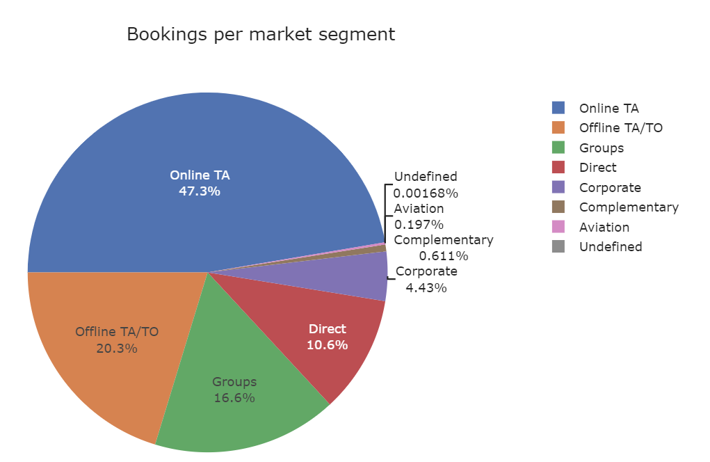
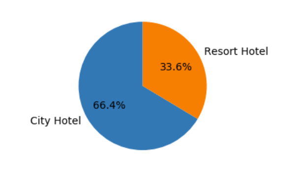
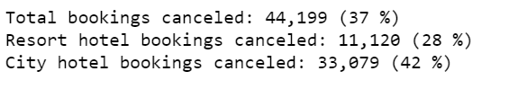
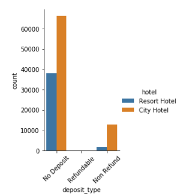
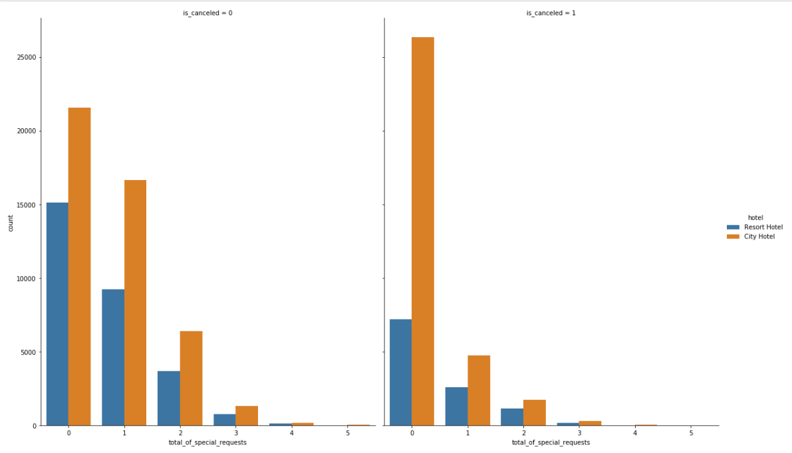
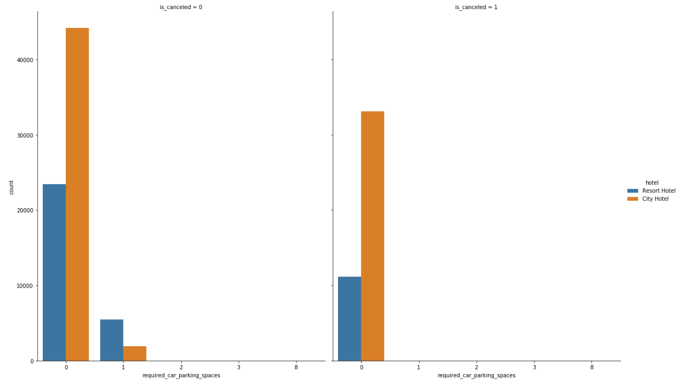
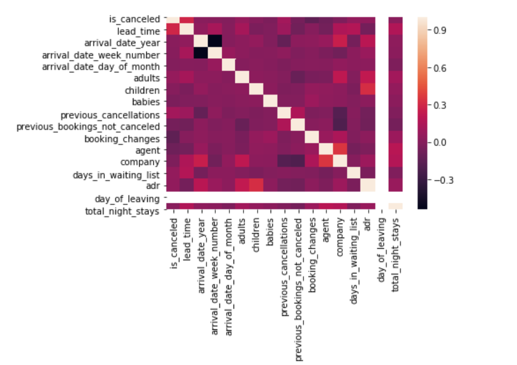

## [Overview](../README.md)

## [Data Cleaning and Preparation](../Data_Cleaning/Data_Cleaning.md)

# Data Exploration

## [Feature Selection](../Feature_Selection/Feature_Selection.md)

## [Models and Pipeline](../Pipeline.md)

## [Deep Learning](../Deep_Learning/Deep_Learning.md)

To start with data exploration, we analysed the total number of bookings by different segments.  

  

**Inference**: The above graph shows that most bookings in both hotels are made through online booking segment, which constitutes to around 47% (approx.)  

Now, let see the distribution of booking by hotels  

  

**Inference**: The above graph shows that maximum percentage of bookings are made by City hotel, which constitutes around 66% (approx.)  

We also calculated the percentage of bookings cancelled and by each hotel:  

  

**Inference**: The above data shows that City hotel experiences maximum percentage of cancellations among both the hotels.  

Let see how the deposit `deposit_type` made before booking affects the booking cancellation where `is_canceled` is our target variable to predict.  

  

**Inference**: The above graph shows that maximum number of bookings are made with no deposit, that’s why they are getting cancelled.  

Now, let us analyse how special request made by guests affects the booking cancellation.  

  

**Inference**: The above graph shows that the bookings which had no special request are more likely to cancel compared to the bookings which have special requests.  

To analyse the above inference further we plotted a graph for special request for car parking space and analysed how it affects the booking cancellation.  

  

**Inference**: The above graph shows that people who have requested for car parking space never cancelled the booking whereas the people who have not requested parking space mostly cancelled the booking.  

In the last of data-exploration we tried to plot the correlation heat map of all the attributes to find the best features for the further analysis.  

  

We did not get a clear picture of the correlation form the above heatmap. So we tried to employ another method for feature engineering which is Cramer’s V test. Please visit Feature Selection section for further analysis.
