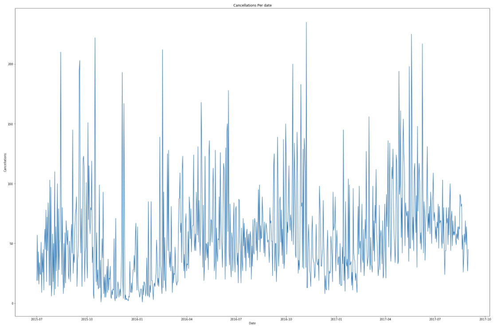
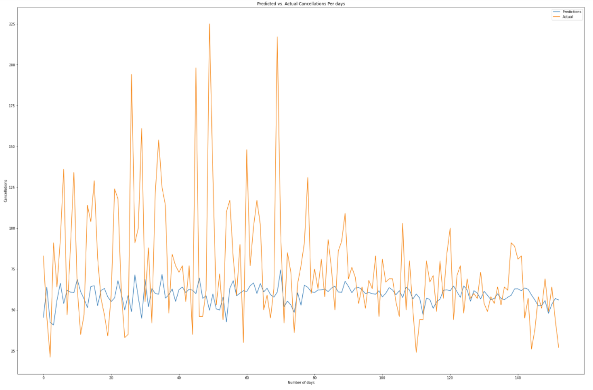
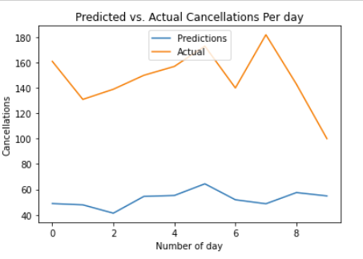
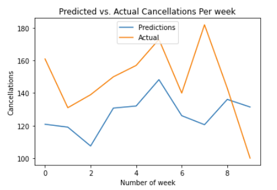

## [Overview](../README.md)

## [Data Cleaning and Preparation](../Data_Cleaning/Data_Cleaning.md)

## [Data Exploration](../Data_Exploration/Data_Exploration.md)

## [Feature Selection](../Feature_Selection/Feature_Selection.md)

## [Models and Pipeline](../Pipeline.md)

# Deep Learning  

Out of curosity, just to dig deepper into this problem, we decided to employ deep-learning for predicting daily and weekly cancellations using LSTM. This type of analysis will be really helpful for small hospitality businesses like Motels or rental cottages as this would help them to predict daily or weekly cancellations and for a small business it is more convienient for them to plan near future rather than planning a year ahead.

**Libraries Used**
`Python`
* [Keras](https://keras.io/): The python deep learning API
* [Tensorflow](https://www.tensorflow.org/): Python deep learning library
* [statsmodel](https://www.statsmodels.org/stable/index.html): Python module for the estimation of statistical models

### Daily Cancellaton:

##### Feature Engineering
We have created a column date by merging the necessary columns and then fetched the data column and finally aggregated the number of cancellations per date and plotted the respective graph.
```Python
df['arrival_date_year'] = df['arrival_date_year'].astype(int)
df['arrival_date_month'] = pd.to_datetime(df.arrival_date_month, format='%B').dt.month
df['arrival_date_day_of_month'] = df['arrival_date_day_of_month'].astype(int)
df['Date'] = df.apply(lambda x : datetime(x['arrival_date_year'], x['arrival_date_month'], x['arrival_date_day_of_month']),axis = 1)
```
```Python
# Aggregate the number of cancellations per day
df2 = df1.groupby('Date').agg(sum)
df2.sort_values(['Date'], ascending=True, inplace=True)
```
**PLOT: Cancellation count Vs. Day**  

  


##### Model Configuration  
For the model configuration we:
* Split the data set for testing and training  
* Created Data matrix  
* Created the LSTM model using Keras  
```Python
model = tf.keras.Sequential()
model.add(LSTM(4, input_shape=(1, look_back)))
model.add(Dense(1))
model.compile(loss='mean_squared_error', optimizer='adam')
model.fit(trainX, trainY, epochs=100, batch_size=1, verbose=2)
```

##### Prediction & Validation  
Predicted the cancellations PER day  

  

**Inference**: We saw the predicted values follow the exact trend as the actual values but are forecasted much lower , this was due to the negative-biased forecast error that we can observe from the picture below.  

Run the LSTM model on the created Validation Dataset.  



**Inference**: Since the data is plotted on a daily basis the number of observations were very high ,  hence to understand the cancellation trend we repeated the same process on a WEEKLY BASIS.  

### Weekly Cancellaton:

##### Feature Engineering
We fetched the arrival week and year column merged it . Finally aggregated the number of cancellations per week and plotted the respective graph.  
```Python
data5 = data4.groupby('Date').agg(sum)
data5.sort_values(['Date'], ascending=True)
```  

##### Model Configuration
For the model configuration we:  
* Split the data set for testing and training  
* Create Data matrix  
* Ran the LSTM model  
```Python
trainPredict = model.predict(trainX)
testPredict = model.predict(testX)  

trainPredict = scaler.inverse_transform(trainPredict)
trainY = scaler.inverse_transform([trainY])
testPredict = scaler.inverse_transform(testPredict)
testY = scaler.inverse_transform([testY])
predictions = testPredict
```  

##### Prediction & Validation  
Predicted the cancellations PER week.

  

**Inference**: By changing the model weekly basis we can see that it is easier to understand the cancellations per week as by this we could reduce the bias in the dataset as the dataset had observations of 2016 , initial half of 2015 and final half of 2017. Also here the predicted values shows the exact trend as that of the actual value , unfortunately here also they suffered from a negative bias error but this error was lesser than the forecast error observed from the daily basis prediction. 
* Calculate the accuracy  
After mathematically removing the forecast error from the predictions we could finally achieve an *accuracy of 97.2%* 

#### Future Work  
Run the booking cancellation predictions on an ARIMA model as it triangulates the data and avoids the negative forecast bias error. 


