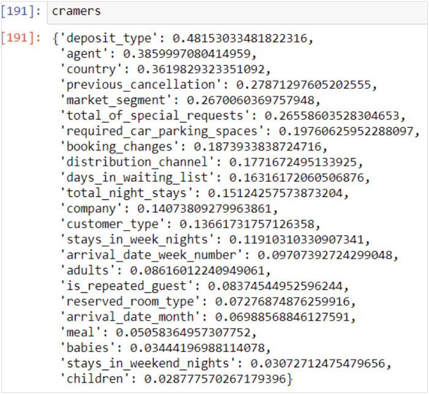

## [Overview](../README.md)

## [Data Cleaning and Preparation](../Data_Cleaning/Data_Cleaning.md)

## [Data Exploration](../Data_Exploration/Data_Exploration.md)

# Feature Selection

## [Models and Pipeline](../Pipeline.md)

## [Deep Learning](../Deep_Learning/Deep_Learning.md)  

Our target variable `is_canceled` is a categorical variable. Majority of the features in our dataset are categorical variables. To find relation between two categorical variables we conducted the Cramer’s V test. The input of the Cramer’s V test is the statistic component of the chi square test. Below is the formula for the Cramer’s V test:  

  

```Python
cramers={}  

indexer = StringIndexer(inputCol="adults", outputCol="adultsIndex")
assembler=VectorAssembler(inputCols=['adultsIndex'],outputCol='adultsVector')
pipeline = Pipeline(stages=[indexer,assembler])
Hotel_Bookings=pipeline.fit(Hotel_Bookings).transform(Hotel_Bookings)  

r=ChiSquareTest.test(Hotel_Bookings,'adultsVector','is_canceled').head()
print("pValues: " + str(r.pValues))
print("degreesOfFreedom: " + str(r.degreesOfFreedom))
print("statistics: " + str(r.statistics))
cramers['adults']=float(np.sqrt(r.statistics/Hotel_Bookings.count()))
```
The above code shows how the Cramer’s V score was calculated. The score for each feature was stored in a dictionary called **cramers**. The top features in the dictionary were selected for modelling.  


